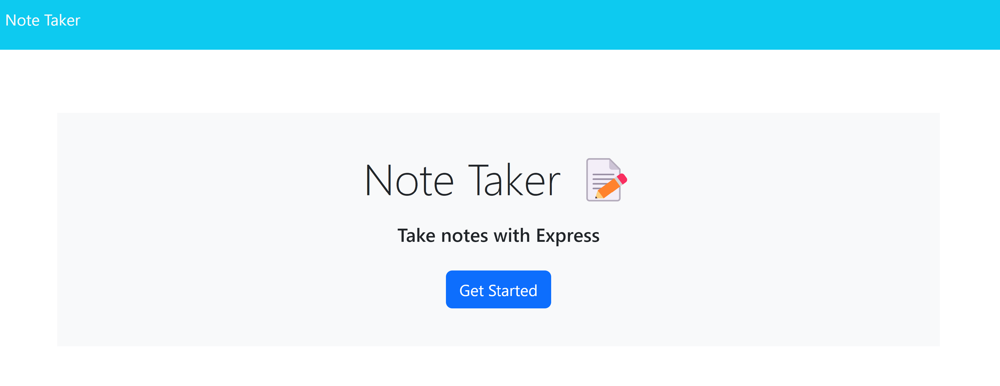

# Note Taker 

## Description
The note taker application allows users to write and read notes to create a to-do list. The application provided an opportunity to learn about the functionality of API routes and how to use an express.js server. It uses starter front end code from the UT Coding Bootcamp, and I have added the API routes.

## Installation

The app is a deployed website, and can be used at the site URL without installing anything.

## Usage

Provide instructions and examples for use. Include screenshots as needed.

To use the app, click the get started button as pictured in the screenshot, and enter the notes you wish to save.  The newly written notes will be shown on screen once saved. The app can be acessed at the following URL: https://polar-wildwood-78954-0e40ca0d7bc7.herokuapp.com/

    

## Credits

Collaboration:

Bootcamp tutor Alexis Gonzalez: 
-Explanation of use and setup of different types of routes for files vs API data
-Explanation and setup of how to use middleware
-Troubleshooting/explanation of how to use API routes with JSON data, reading/writing/parsing data

Bootcamp TA Tye Stanley: debugging req.data for post request, setup of express middleware lines 15-16 database

AI Xpert:
Troubleshooting use of fs.readFile, corrected syntax for readFile parameters and use of ‘const’ for handling parsed json data in server.js lines 30-44

Source for syntax when writing files:
NodeJS. (n.d.). Node.js — Writing files with Node.js. Node.js. Retrieved April 6, 2024, from https://nodejs.org/en/learn/manipulating-files/writing-files-with-nodejs

Source re: Parsing and writing new info to the database:
Stack Overflow. (2021, December 13). How to write to a array in JSON file without replacing the entire file. Stack Overflow. Retrieved April 6, 2024, from https://stackoverflow.com/questions/70338830/how-to-write-to-a-array-in-json-file-without-replacing-the-entire-file

## License

This project uses an MIT license. More information available in the 'License' section of the repository or here: https://choosealicense.com/licenses/mit/ 
